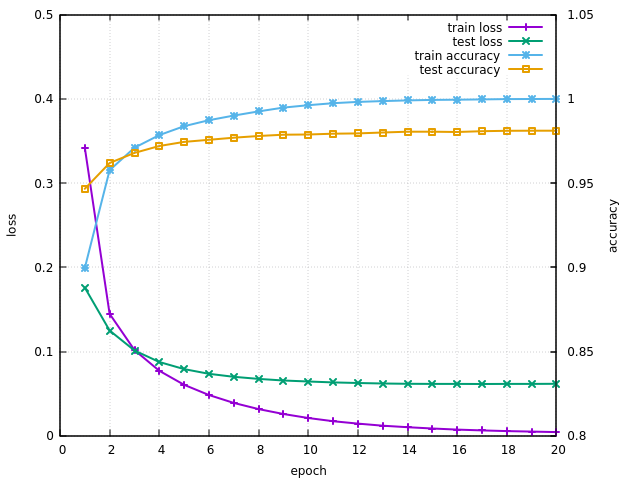
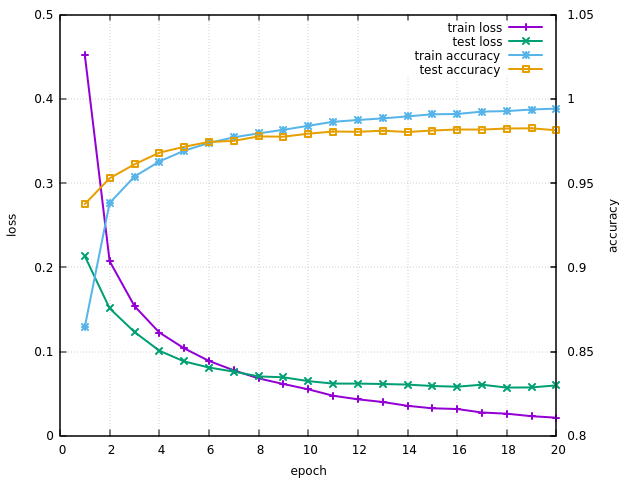

# mnist_euslisp
learning mnist with euslisp

## Download mnist dataset
- http://yann.lecun.com/exdb/mnist/

## Decompress mnist dataset
```
$ gzip -dc train-images-idx3-ubyte.gz >train-images-idx3-ubyte
$ gzip -dc train-labels-idx1-ubyte.gz >train-labels-idx1-ubyte
$ gzip -dc t10k-images-idx3-ubyte.gz >test-images-idx3-ubyte
$ gzip -dc t10k-labels-idx1-ubyte.gz >test-labels-idx1-ubyte
```

## Convert dataset to text file
```
$ od -An -v -tu1 -j16 -w784 train-images-idx3-ubyte | sed 's/^ *//' | tr -s ' ' >train-images.txt
$ od -An -v -tu1 -j8 -w1 train-labels-idx1-ubyte | tr -d ' ' >train-labels.txt
$ od -An -v -tu1 -j16 -w784 test-images-idx3-ubyte | sed 's/^ *//' | tr -s ' ' >test-images.txt
$ od -An -v -tu1 -j8 -w1 test-labels-idx1-ubyte | tr -d ' ' >test-labels.txt

$ rm *-ubyte
$ rm *.gz
```

## Build
```
# for C
$ cd ./MATPROD
$ make

# for cuBLAS
$ cd ./eus_cuda_matrix
$ mkdir build
$ cd build
$ cmake ..
$ make
```

## Accelarate simulation, otherwise simulation won't finish!
1. Dump mnist datasets as euslisp file
```
$ roseus
irteusgl$ (compile-file "mnist.l")
irteusgl$ (progn (load "mnist.so") (test) (dump-loadable-structure "mnist-datasets.l" *train-images* *train-labels* *test-images* *test-labels*))
```

2. Compile euslisp file
```
irteusgl$ (compile-file "nn.l")
```

## Utilize OpenBLAS (Optional)
```
$ sudo apt-get install libopenblas-base libopenblas-dev
$ sudo update-alternatives --config libblas.so.3
Select 3.
```

## Run simulation
```
$ roseus
irteusgl$ (load "nn.so")

irteusgl$ (test-mnist-batch 200 :cblas)  ;; train with minibatch size 200, CBLAS/OpenBLAS
irteusgl$ (test-mnist-batch 200 :cublas) ;; train with minibatch size 200, cuBLAS

irteusgl$ (test-mnist-batch-test 200 :cblas)  ;; train and test sequentially with CBLAS/OpenBLAS
irteusgl$ (test-mnist-batch-test 200 :cublas) ;; train and test sequentially with cuBLAS

irteusgl$ (test-mnist-test) ;; test with train images
irteusgl$ (test-mnist-test) ;; test with test images
```

## Results
- Result of `(test-mnist-batch-test 200 :cblas 1.0)`


- Result of `(test-mnist-batch-test 200 :cblas 0.8)`

