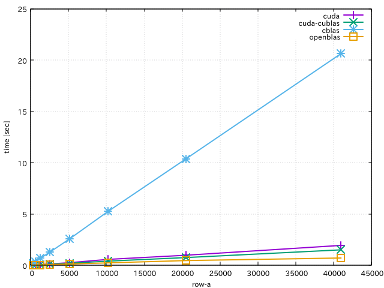
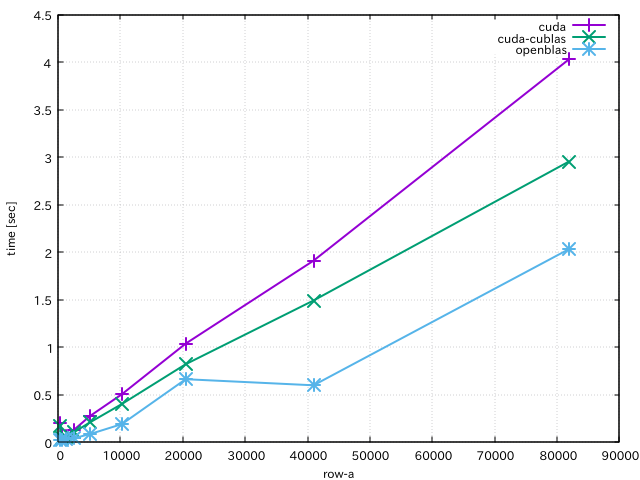
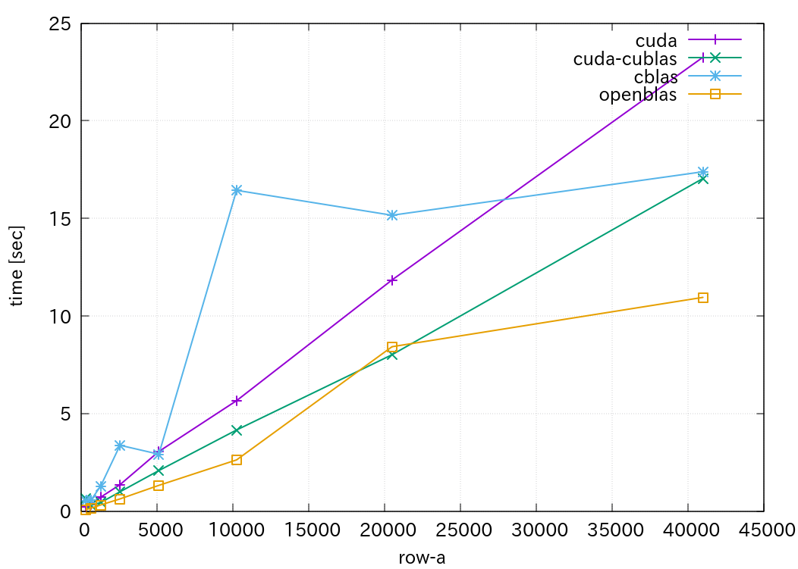

## Document
referred to https://github.com/mmurooka/test/tree/master/cuda/eus_cuda_matrix

matrixMul.cu in
https://github.com/NVIDIA/cuda-samples/tree/master/Samples/matrixMul
is edited and used.

Number of columns and rows of matrix should be multiples of 32.

## Build
```
mkdir build
cd build
cmake ..
make
```

## Test

### Test (C++)
```
cd build
./test_matrixMul
./test_matrixMulCUBLAS
```

### Test (EusLisp)
```
cd euslisp/test
roseus test-matrixMul.l "(test-matrixMul)"
roseus test-matrixMulCUBLAS.l "(test-matrixMulCUBLAS)"
```

## Misc

### Compare accuracy of matrix multiplication (cuda, cblas, openblass, EusLisp)
```
cd euslisp/misc
roseus compare-matrix-multiply.l
(compare-matrix-multiply-accuracy) ;; cuda is slow only for the first time
(compare-matrix-multiply-accuracy)
```

### Compare computation time of matrix multiplication (cuda, cblas, openblass)
```
cd euslisp/misc
roseus compare-matrix-multiply.l
(compare-matrix-multiply-time)
;; if you want to see the graph again, do the following command after exiting euslisp
;; gnuplot plot-compare-matrix-multiply-time.plt
```
Result of `(compare-matrix-multiply-time)` with Z640 (CPU is Intel(R) Xeon(R) CPU E5-2690 v3 @ 2.60GHz, 48 threads. GPU is GeForce GTX TITAN).




Result of `(compare-matrix-multiply-time)` with P51 (CPU is Intel(R) Xeon(R) CPU E3-1535M v6 @ 3.10GHz, 8 threads. GPU is Quadro M2200).


